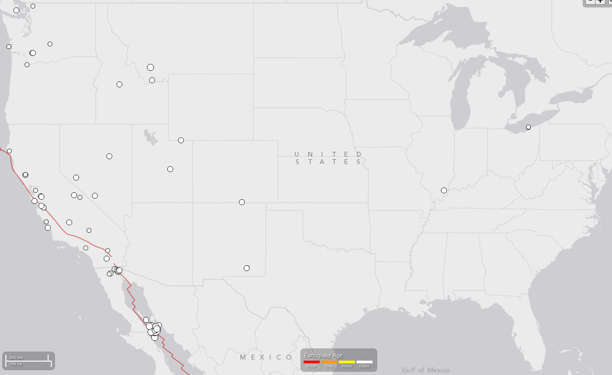
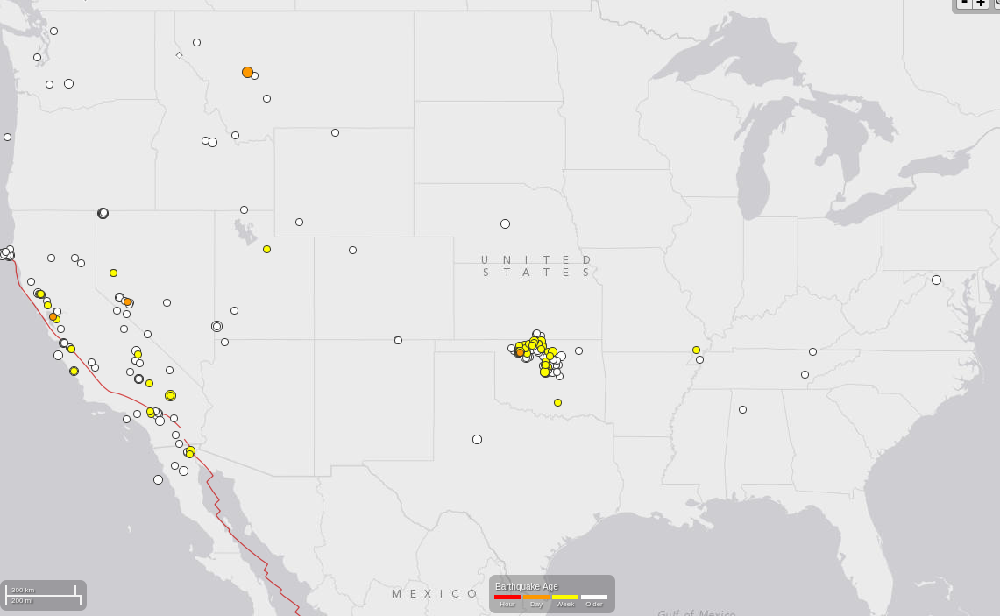
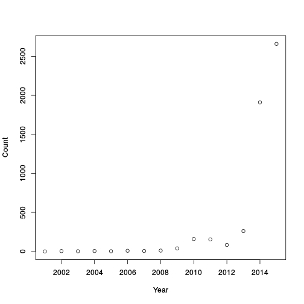
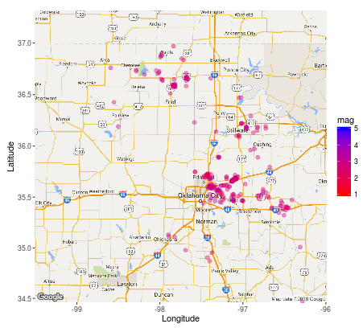

Frequency of Oklahoma earthquakes.
========================================================
author: Gary De Young
date: 2015-01-30

========================================================
## The Ground is Shaking!
Until recently when people thought of where earthquakes occurred in the U.S. the did not think of Oklahoma!
Earthquakes in the eastern 2/3's of the US were rare. Some occurring in the in the Missouri, Arkansas, Kentucky and Tenseness region.

### Majority of Quakes Today (mag 2 and larger)
- California: Mainly along the coast and some the Sierra mountains
- Oklahoma: Central/Northern Oklahoma!


========================================================
## Oklahome: Increase in frequency
The images show a dramatic increase in the Oklahoma area. Both show only 2.3 or larger 
quakes, the minimum magnitude in the data for 2006.
<table border=0>
<tr>
<td></td>
<td></td>
</tr>
<tr>
<td style='text-align:center'>January 2006</td>
<td style='text-align:center'>January 2016</td>
</tr>
</table>
The increasing counts may be due to changing methods of detection; however, a new cluster of quakes is present in Oklahoma (central U.S.A.)

Count Summary
========================================================
Number of quakes 2.3 or greater in the Oklahoma region.


***

```
   year  cnt
1  2001    0
2  2002    4
3  2003    2
4  2004    5
5  2005    2
6  2006    8
7  2007    5
8  2008   10
9  2009   39
10 2010  159
11 2011  154
12 2012   83
13 2013  261
14 2014 1911
15 2015 2660
```
Shiny Web App
========================================================
Using the web app at https://gdeyoung.shinyapps.io/project/

- You explore other years 2001 to 2015 and veiw plots of the locations of quakes.
- You can change the magnitude of the quakes that are counted.
- You can see distributions of the quake magnitude or time intervals between quakes.



